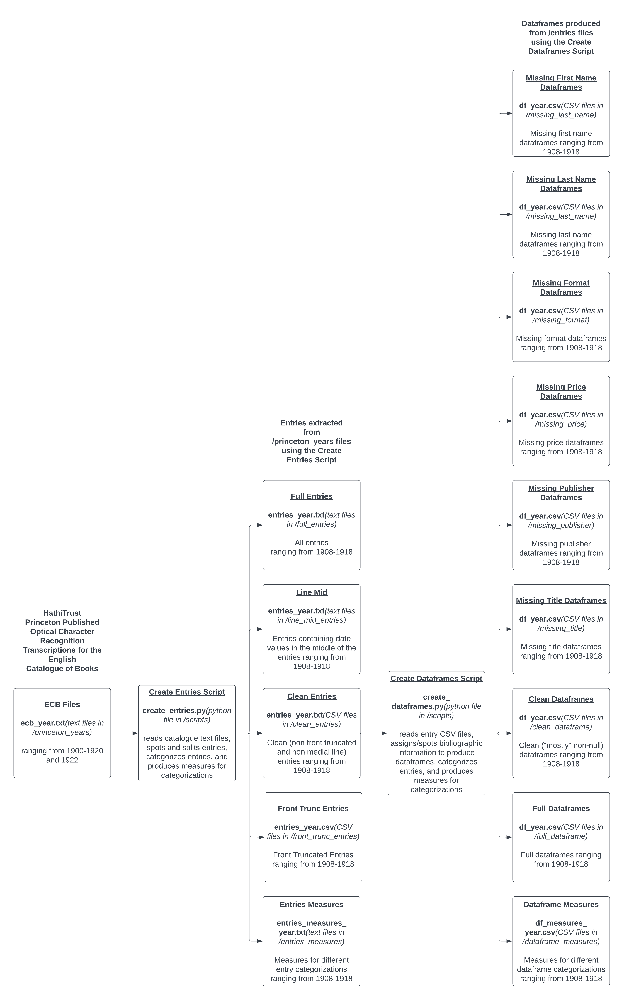

# English Catalogue of Books

## General Repository Information

OCR Data from [Hathi Trust's English Catalogue of Books](https://catalog.hathitrust.org/Record/000550349).

Original OCR text files can be found in `/princeton_years`.

Entries can be found in `/entries` (less processing than data in `/dataframes`).

Dataframes can be found in `/dataframes` (more processing than data in `/entries`).

Original Colab Notebook can be found in `/scripts/Parsing_ECB_1912_wi23.ipynb` and all such other Python scripts can be found in `/scripts` (including documentation for Python scripts).

## Data Schema

Schema files can be found in `\schema`. The Lucid Chart document can be found [here](https://lucid.app/lucidchart/4d30c38e-c769-443d-8c82-fdf6894c5a80/edit?invitationId=inv_f8bb8f35-4b80-400a-8e9b-d774e9de7dbf) (login to Lucid Chart is required). Included below is an image of the schema.

## TODOs

Written for week of 5/3 and onwards:

### Notes
* Consider the following distance functions for an alternate implemention for string matching.For two strings, 
a and b:
    * Levenshtein Distance: The minimal number of insertions, deletions, and symbol substitutions required to transform a into b.
    * Damerau Levenstein: Like the Levenstein Distance, but you can also use transpositions (swapping of adjacent symbols).
    * Optimal String Alignment Distance: Like Damerau Levenstein, but you are not allowed to apply multiple transformations on a same substring (e.g. first transpose two symbols, then insert a third between them).
    * Longest Common Substring: Based on the similarity between characters in the text to express the similarity between texts.
    * Edit Distance: The minimum number of transformations required to convert the string.
    * Jaro Similarity: Not sure how to summarize this [Link](https://en.wikipedia.org/wiki/Jaro%E2%80%93Winkler_distance)

### Will Wait
* Read up on World Cat API and how it could be used to "fill in blanks" and fill up even more information that the English Catalogue does not contain
    * The (get) /bibs request looks to be the most promising: [WorldCat Search API v2](https://developer.api.oclc.org/wcv2#/Bibliographic%20Resources) (in the Bibliographic Resources section)
        * Input query can include the following:
            * Publisher
            * Title
            * Author
            * Keyword
        * We can get these query values from even "incomplete" row values
        * The "datePublished" entry will help us significantly in reducing the results
        * Returns a dictionary of records for a bunch of books with a lot of values:
            * Publisher
            * Subject
            * Title
            * Author
            * Date
        * Can probably come up with some probabilistic or deterministic method that helps us find the returned entry that matches the value with blanks
    * Potential Python Wrapper Library that helps with making World Cat API requests: [bookops-worldcat](https://pypi.org/project/bookops-worldcat/)
        * [Documentation](https://bookops-cat.github.io/bookops-worldcat/0.5/)
        * Supports only OCLC OAuth 2.0 endpoints and flows